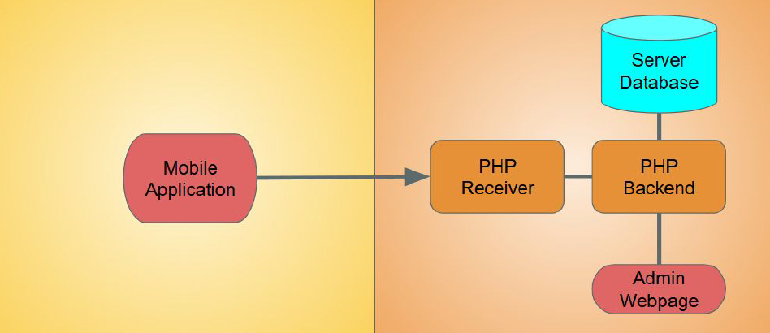
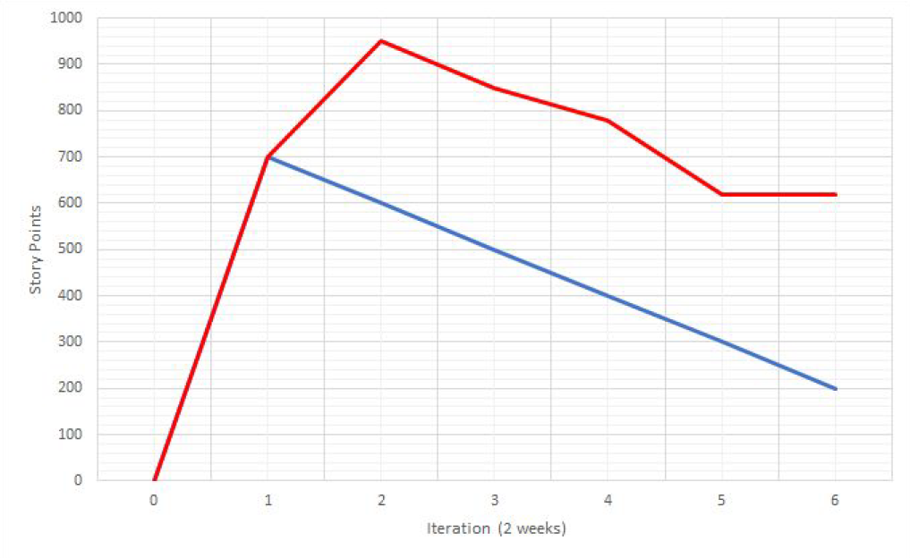
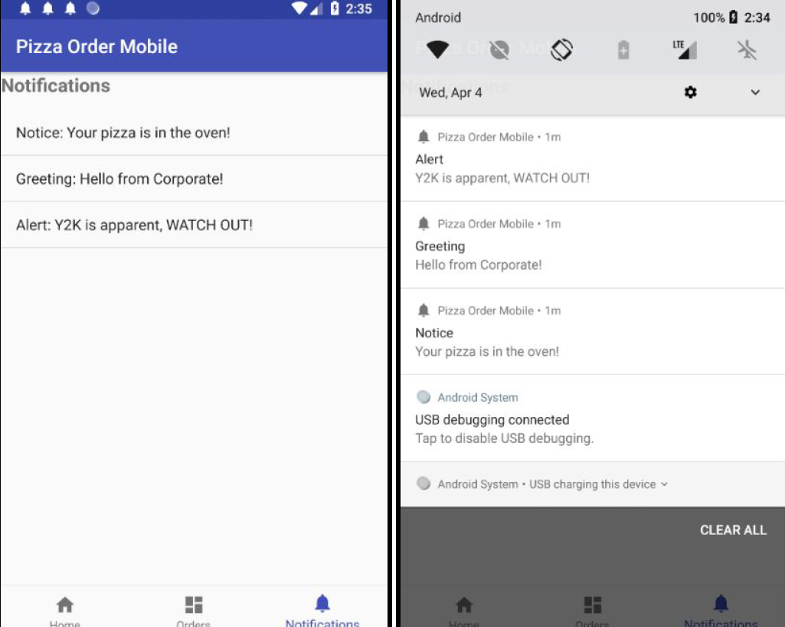
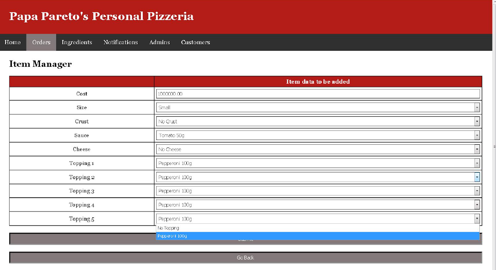

# pizzaOrderServerside

Web application meant to be connected to a MySQL database. Companion application to pizzaOrderMobile.

## Purpose

To build a web application used to service SQL transactions and operations from a SQL database using the Agile Development methodology.

## Repo Contents

* api
  * PHP page for pushing notifications to companion mobile app
* images
  * Contains images used by web application
* ingredientManage
  * PHP pages dedicated to ingredient DB management
* itemManage
  * PHP pages dedicated to order item DB management
* orderManage
  * PHP pages dedicated to order DB management
* notificationManage
  * PHP pages dedicated to notification DB management
* userManage
  * PHP pages dedicated to admin and user info DB management
* styleSheets
  * Contains CSS for web application styling
* ParetoMainMenu.php
  * Main page after login screen
* admins.php
  * Main page for admin management after main menu
* customers.php
  * Main page for user management after main menu
* ingredients.php
  * Main page for ingredient management after main menu
* notifications.php
  * Main page for notification management after main menu
* orders.php
  * Main page for order management after main menu
* paretoLogin.php
  * Simple login page using basic encryption of password

## Description

This web application is meant to be used with a MySQL DB and uses appropriate PHP syntax as a result. Database calls are done right in PHP script. A companion mobile application makes use of notifications packaged by the web application, mainly pertaining to current orders.

The web applications itself was developed with Agile methodologies in mind, making use of Trello for simple story management. Stories encompassed usable features during development, and a burndown analysis was conducted. Effectiveness of the Agile method was also examined.

### System Structure

The whole system was divided into two main components: the user component and an administrative component. The user component included the mobile application only, allowing users to receive notifications from the server. On the admin side, the component consisted of a PHP receiver, backend service, DB, and webpage. The admin or web application would then be accessible to admin users only, via login credentials. 

The structure of the system allowed control of what the mobile application could see, rather than allow complete access to the database (in essence, a web service). Admins however, could manipulate DB data directly through the web application.

The mobile application only allowed users to see notifications relevant to them (identified with customer data).

The web application allowed manipulation of orders, ingredients, order contents, and user data. This included all CRUD operations relevant to an SQL DB.

### Use of Agile Method

The main purpose of the project was to examine the use of the Agile Development methodology in practice. Major featuires were written and implemented and user stories in order to better divided development work amongst a team, as shown below.

Massive features were displayed as 'epics', furthur broken down into 'stories'. These were then rotated around every iteration, which lasted 2 weeks. Total development time lasted 6 iterations or 12 weeks. Each story was given a score based on the team's review of the difficulty of implementation. These story points then correlated directly to effectiveness, a shown below in a burndown chart.

As the iterations passed, actual development and its remaining points are shown in red. Estimatted development and its remaining points were shown in blue.

What was realized, was that actual development poorly followed estimated development. Instead of a steady decrease in story points as features were implemented, it was found that development speed fluctuated due to unpredicted difficulties in the implementation of certain features.

Mainly, a large slowing down of the development was due to mobile application development. Although Agile development is meant tto combat unfamiliar coding practices and methods by rotating team members on responsibilities, slowdown was still evident when conducting the burndown analysis.

### Development Results

The mobile application, although difficult in implementation, was completed as a technical mockup. Its features included display of notifications provided through web application when successful orders were constructed for product.

The web application was completed with a rudimentary login page. It allowed complete CRUD operations on the MySQL DB. It also allowed the creation of new customer accounts and admin accounts. It was completed with styling also, presenting a simple and usable user interface through HTML/CSS

